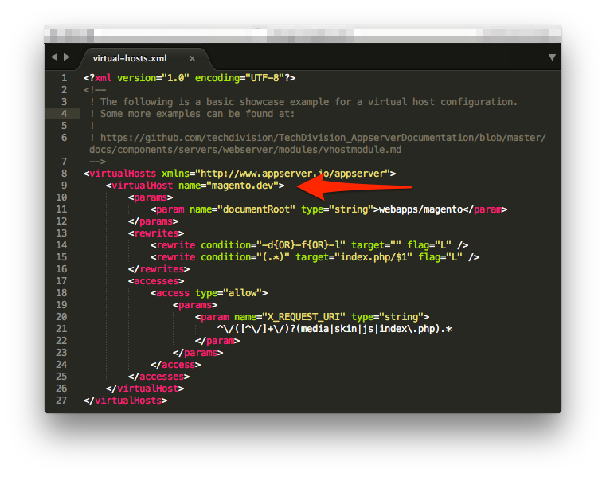
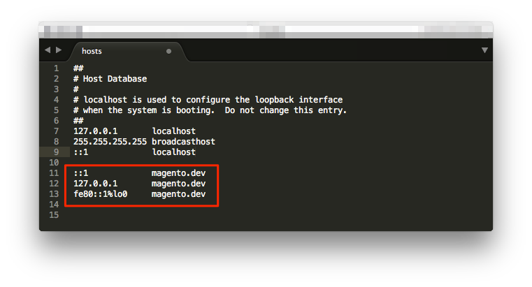
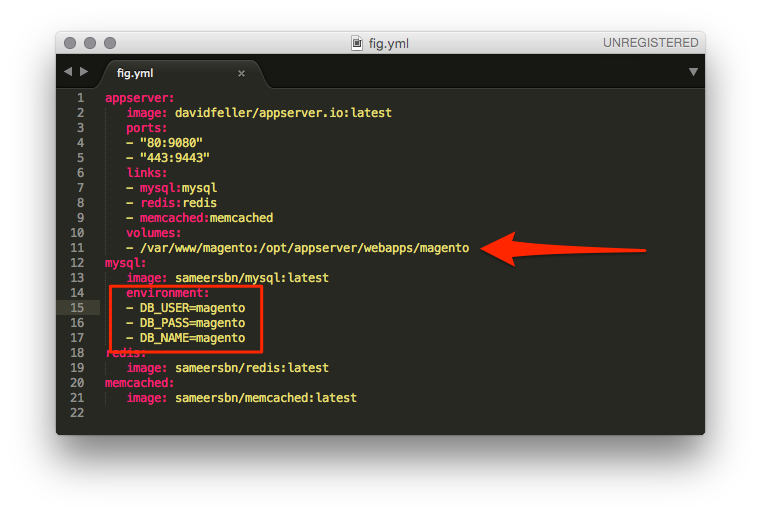
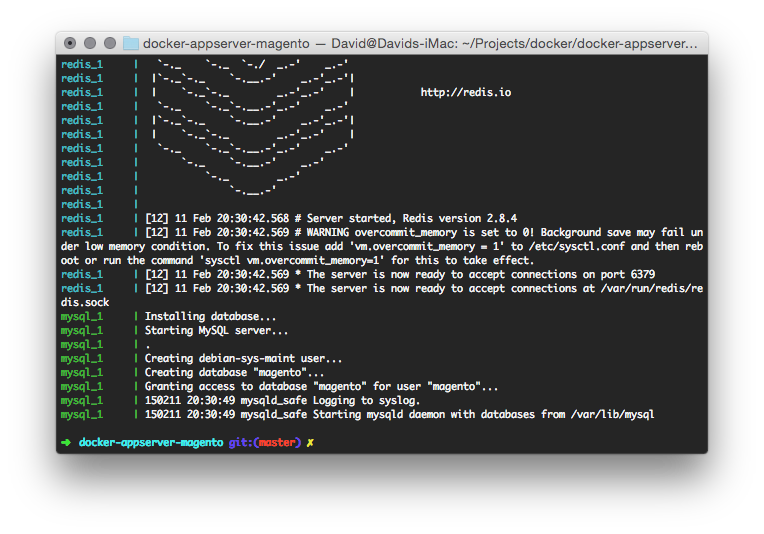
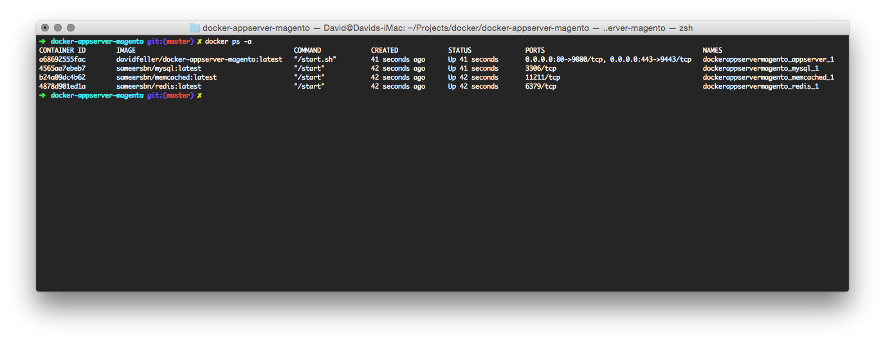

#Docker, appserver.io & Magento

## Introduction
Dockerfile to build appserver.io, MySQL, Redis and memcached in order to run Magento (CE).

## Requirements
- Docker version >= v1.3
- [Fig](http://www.fig.sh/index.html)  - "Fast, isolated development environments using Docker"
- GNU Linux Kernel version >= 3.8 on the host machine

## Quick Start

1. Clone the repository from GitHub

		git clone https://github.com/DavidFeller/docker-appserver-magento.git
		cd docker-appserver-magento

2. Come up with a suitable name for your *virtualHost* and change it as following `config/virtual-hosts.xml`. 
3. (Optional) Add the hostname to your `hosts` file, if you are in a development enviroment. 
4. Unpack the magento source to any directory on your local drive (e.g. `/var/www/magento`) and change the path in the volumes section of `fig.yml` accordingly. In production environments, you also might want to change the credentials in the mysql section. 
5. Start all containers using `fig`. Of course, it's possible to start them individually. 

		fig up

6. **Mission accomplished!** Now switch to your browser, open your new virtual host (e.g. `http://magento.dev`) and install magento as usual. Make sure to enter `mysql` as database host (**not** localhost).